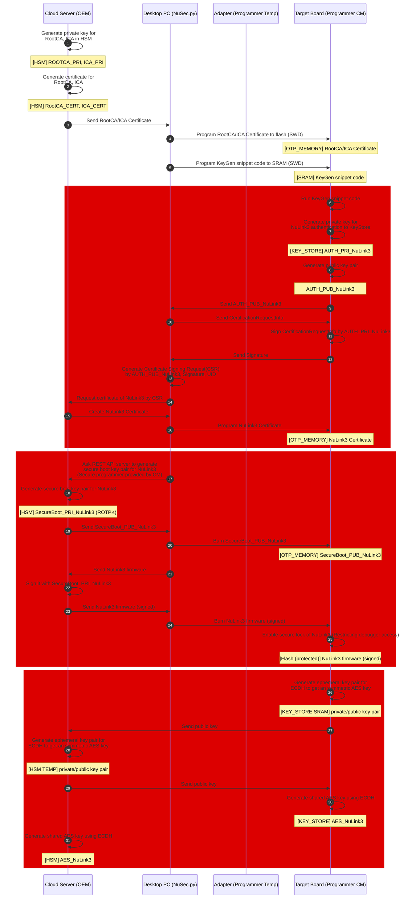

### Prepare NuLink3 programmer for CM (by OEM)

```mermaid
sequenceDiagram
    autonumber
	participant c as Cloud Server (OEM)
	participant d as Desktop PC (NuSec.py)
	participant a as Adapter (Programmer Temp)
	participant t as Target Board (Programmer CM)
    c ->> c: Generate private key for <br/>RootCA, ICA in HSM
    Note over c: [HSM] ROOTCA_PRI, ICA_PRI
    c ->> c: Generate certificate for <br/> RootCA, ICA 
    Note over c: [HSM] RootCA_CERT, ICA_CERT
    c ->> d: Send RootCA/ICA Certificate
    d ->> t: Program RootCA/ICA Certificate to flash (SWD)
    Note over t: [OTP_MEMORY] RootCA/ICA Certificate
    d ->> t: Program KeyGen snippet code to SRAM (SWD)
    Note over t: [SRAM] KeyGen snippet code

    Rect rgb(220, 0, 0)
    t ->> t: Run KeyGen snippet code
    t ->> t: Generate private key for <br/>NuLink3 authentication to KeyStore
    Note over t: [KEY_STORE] AUTH_PRI_NuLink3
    t ->> t: Generate public key pair
    Note over t: AUTH_PUB_NuLink3
    t ->> d: Send AUTH_PUB_NuLink3
    d ->> t: Send CertificationRequestInfo
    t ->> t: Sign CertificationRequestInfo by AUTH_PRI_NuLink3
    t ->> d: Send Signature
    d ->> d: Generate Certificate Signing Request(CSR) <br/>by AUTH_PUB_NuLink3, Signature, UID
    d ->> c: Request certificate of NuLink3 by CSR
    c ->> d: Create NuLink3 Certificate
    d ->> t: Program NuLink3 Certificate
    Note over t: [OTP_MEMORY] NuLink3 Certificate
    end

    Rect rgb(220, 0, 0)
    d ->> c: Ask REST API server to generate<br/>secure boot key pair for NuLink3 <br/>(Secure programmer provided by CM) 
    c ->> c: Generate secure boot key pair for NuLink3
    Note over c: [HSM] SecureBoot_PRI_NuLink3 (ROTPK)
    c ->> d: Send SecureBoot_PUB_NuLink3
    d ->> t: Burn SecureBoot_PUB_NuLink3
    Note over t: [OTP_MEMORY] SecureBoot_PUB_NuLink3
    d ->> c: Send NuLink3 firmware
    c ->> c: Sign it with SecureBoot_PRI_NuLink3
    c ->> d: Send NuLink3 firmware (signed)
    d ->> t: Burn NuLink3 firmware (signed)
    t ->> t: Enable secure lock of NuLink3 (Restricting debugger access)
    Note over t: [Flash (protected)] NuLink3 firmware (signed)
    end
    
    %%ECDH
    Rect rgb(220, 0, 0)
    t ->> t: Generate ephemeral key pair for <br/> ECDH to get an symmetric AES key
    Note over t: [KEY_STORE SRAM] private/public key pair
    t ->> c: Send public key
    c ->> c: Generate ephemeral key pair for <br/> ECDH to get an symmetric AES key
    Note over c: [HSM TEMP] private/public key pair
    c ->> t: Send public key
    t ->> t: Generate shared AES key using ECDH
    Note over t: [KEY_STORE] AES_NuLink3
    c ->> c: Generate shared AES key using ECDH
    Note over c: [HSM] AES_NuLink3
    end

```
