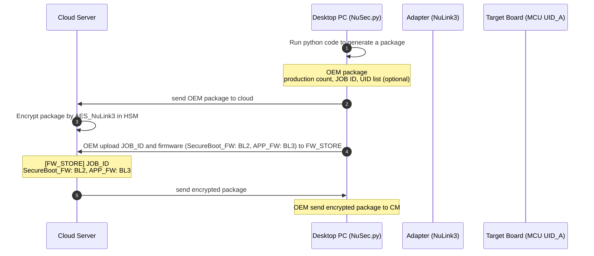

### Package export (by OEM)

```mermaid
sequenceDiagram
    autonumber
	participant c as Cloud Server
	participant d as Desktop PC (NuSec.py)
	participant a as Adapter (NuLink3)
	participant t as Target Board (MCU UID_A)
    d ->> d: Run python code to generate a package 
    note over d: OEM package <br/> production count, JOB ID, UID list (optional)
    d ->> c: send OEM package to cloud
    c ->> c: Encrypt package by AES_NuLink3 in HSM
    d ->> c: OEM upload JOB_ID and firmware (SecureBoot_FW: BL2, APP_FW: BL3) to FW_STORE
    note over c: [FW_STORE] JOB_ID <br/>SecureBoot_FW: BL2, APP_FW: BL3
    c ->> d: send encrypted package
    note over d: OEM send encrypted package to CM 
```
