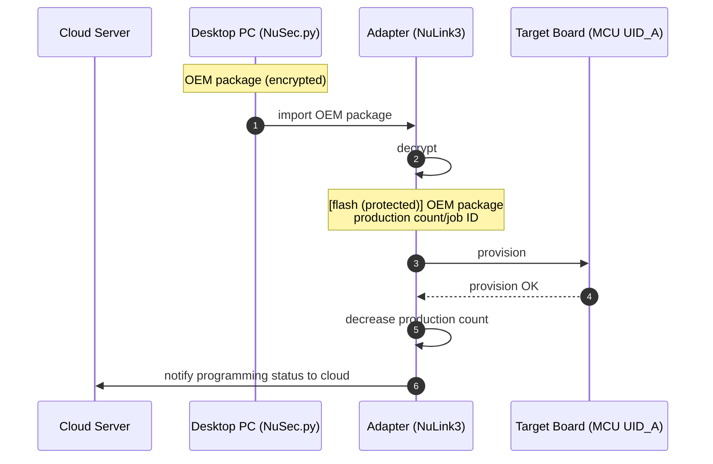

### Package import (by CM)

```mermaid
sequenceDiagram
    autonumber
	participant c as Cloud Server
	participant d as Desktop PC (NuSec.py)
	participant a as Adapter (NuLink3)
	participant t as Target Board (MCU UID_A)
    note over d: OEM package (encrypted)
    d ->> a: import OEM package
    a ->> a: decrypt
    note over a: [flash (protected)] OEM package <br/>production count/job ID
    a ->> t: provision
    t-->> a: provision OK
    a ->> a: decrease production count
    a ->> c: notify programming status to cloud
```
