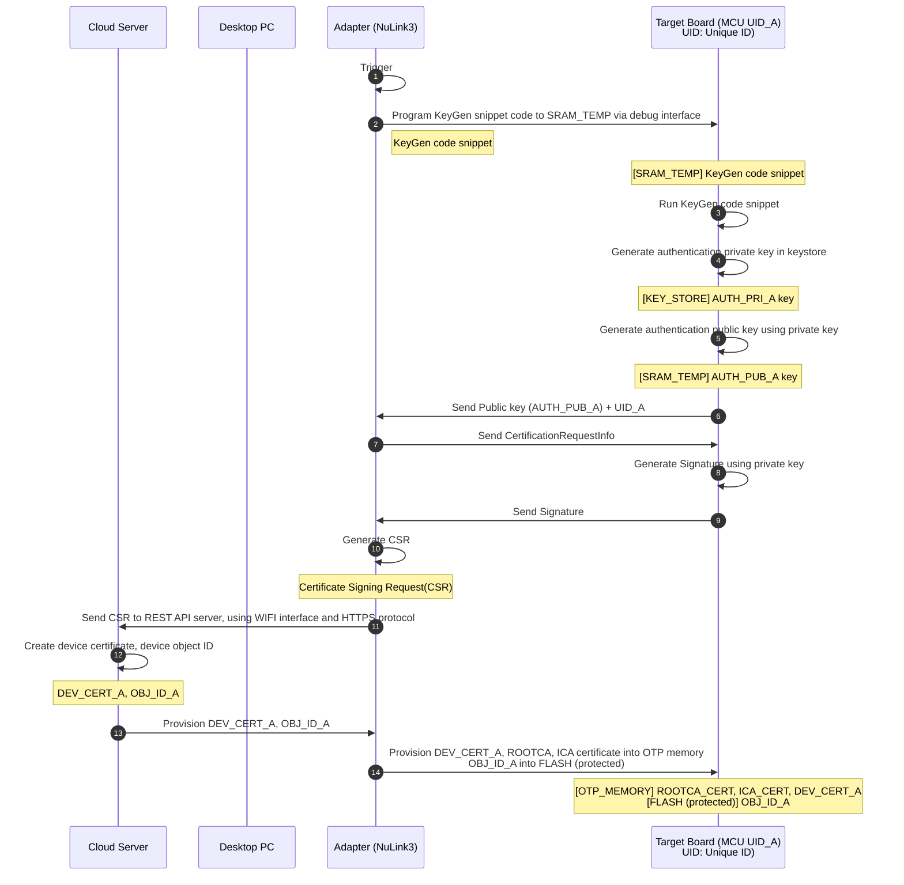

```mermaid
sequenceDiagram
    autonumber
    participant c as Cloud Server
    participant d as Desktop PC
    participant a as Adapter (NuLink3)
    participant t as Target Board (MCU UID_A)<br/> UID: Unique ID)
    a ->> a : Trigger
    a ->> t : Program KeyGen snippet code to SRAM_TEMP via debug interface 
    Note right of a: KeyGen code snippet 
    Note over t: [SRAM_TEMP] KeyGen code snippet 
    t ->> t : Run KeyGen code snippet 
    t ->> t : Generate authentication private key in keystore
    Note over t: [KEY_STORE] AUTH_PRI_A key
    t ->> t : Generate authentication public key using private key 
    Note over t: [SRAM_TEMP] AUTH_PUB_A key
    t ->> a : Send Public key (AUTH_PUB_A) + UID_A 
    a ->> t : Send CertificationRequestInfo    
    t ->> t : Generate Signature using private key
    t ->> a : Send Signature
    a ->> a : Generate CSR
    Note over a: Certificate Signing Request(CSR)
    a ->> c : Send CSR to REST API server, using WIFI interface and HTTPS protocol
    c ->> c : Create device certificate, device object ID
    Note over c: DEV_CERT_A, OBJ_ID_A
    c ->> a : Provision DEV_CERT_A, OBJ_ID_A
    a ->> t : Provision DEV_CERT_A, ROOTCA, ICA certificate into OTP memory <br/>OBJ_ID_A into FLASH (protected)
    Note over t: [OTP_MEMORY] ROOTCA_CERT, ICA_CERT, DEV_CERT_A <br/>[FLASH (protected)] OBJ_ID_A
```
