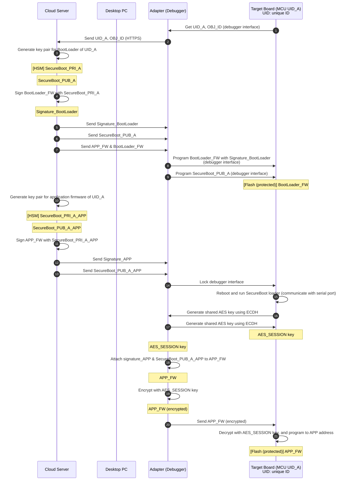

```mermaid
sequenceDiagram
    autonumber
    participant c as Cloud Server
    participant d as Desktop PC
    participant a as Adapter (Debugger)
    participant t as Target Board (MCU UID_A) <br/>UID: unique ID
    t ->> a : Get UID_A, OBJ_ID (debugger interface)
    a ->> c : Send UID_A, OBJ_ID (HTTPS)
    c ->> c : Generate key pair for BootLoader of UID_A
    Note over c : [HSM] SecureBoot_PRI_A 
    Note over c : SecureBoot_PUB_A
    c ->> c : Sign BootLoader_FW with SecureBoot_PRI_A
    Note over c : Signature_BootLoader
    c ->> a : Send Signature_BootLoader
    c ->> a : Send SecureBoot_PUB_A
    c ->> a : Send APP_FW & BootLoader_FW
    a ->> t : Program BootLoader_FW with Signature_BootLoader <br/>(debugger interface)
    a ->> t : Program SecureBoot_PUB_A (debugger interface)
    Note over t: [Flash (protected)] BootLoader_FW 

    c ->> c : Generate key pair for application firmware of UID_A
    Note over c : [HSM] SecureBoot_PRI_A_APP 
    Note over c : SecureBoot_PUB_A_APP
    c ->> c : Sign APP_FW with SecureBoot_PRI_A_APP
    c ->> a : Send Signature_APP
    c ->> a : Send SecureBoot_PUB_A_APP
    a ->> t : Lock debugger interface 
    t ->> t : Reboot and run SecureBoot loader (communicate with serial port)
    
    %% ECDH
    t ->> a: Generate shared AES key using ECDH
    a ->> t: Generate shared AES key using ECDH
    Note over t: AES_SESSION key
    Note over a: AES_SESSION key

    a ->> a: Attach signature_APP & SecureBoot_PUB_A_APP to APP_FW
    Note over a: APP_FW
    a ->> a: Encrypt with AES_SESSION key
    Note over a: APP_FW (encrypted)
    a ->> t: Send APP_FW (encrypted)
    t ->> t: Decrypt with AES_SESSION key, and program to APP address
    Note over t: [Flash (protected)] APP_FW

```
