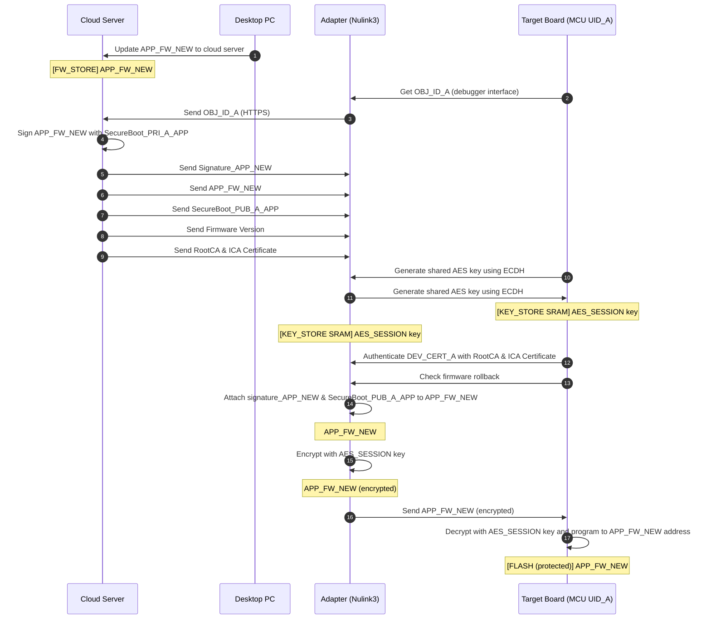

```mermaid
sequenceDiagram
    autonumber
    participant c as Cloud Server
    participant d as Desktop PC
    participant a as Adapter (Nulink3)
    participant t as Target Board (MCU UID_A)

    d ->> c : Update APP_FW_NEW to cloud server
    Note over c: [FW_STORE] APP_FW_NEW
    t ->> a : Get OBJ_ID_A (debugger interface)
    a ->> c : Send OBJ_ID_A (HTTPS)
    
    c ->> c : Sign APP_FW_NEW with SecureBoot_PRI_A_APP
    c ->> a : Send Signature_APP_NEW
    c ->> a : Send APP_FW_NEW
    c ->> a : Send SecureBoot_PUB_A_APP
    c ->> a : Send Firmware Version
    c ->> a : Send RootCA & ICA Certificate
    
    %% ECDH
    t ->> a: Generate shared AES key using ECDH
    a ->> t: Generate shared AES key using ECDH
    Note over t: [KEY_STORE SRAM] AES_SESSION key
    Note over a: [KEY_STORE SRAM] AES_SESSION key

    t ->> a: Authenticate DEV_CERT_A with RootCA & ICA Certificate
    t ->> a: Check firmware rollback
    a ->> a: Attach signature_APP_NEW & SecureBoot_PUB_A_APP to APP_FW_NEW
    Note over a: APP_FW_NEW
    a ->> a: Encrypt with AES_SESSION key
    Note over a: APP_FW_NEW (encrypted)
    a ->> t: Send APP_FW_NEW (encrypted)
    t ->> t: Decrypt with AES_SESSION key and program to APP_FW_NEW address
    Note over t: [FLASH (protected)] APP_FW_NEW
```
