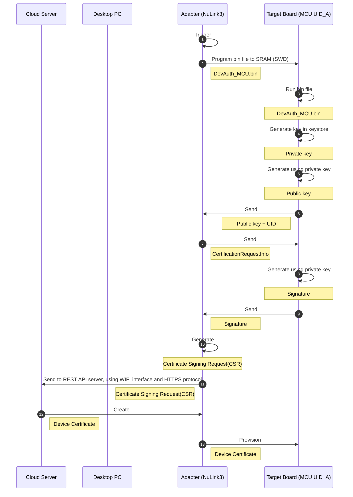

```mermaid
sequenceDiagram
    autonumber
    participant c as Cloud Server
    participant d as Desktop PC
    participant a as Adapter (NuLink3)
    participant t as Target Board (MCU UID_A)
    a ->> a : Trigger
    a ->> t : Program bin file to SRAM (SWD)
    Note right of a: DevAuth_MCU.bin
    t ->> t : Run bin file
    Note over t: DevAuth_MCU.bin
    t ->> t : Generate key in keystore
    Note over t: Private key
    t ->> t : Generate using private key
    Note over t: Public key
    t ->> a : Send
    Note left of t: Public key + UID
    a ->> t : Send
    Note right of a: CertificationRequestInfo
    t ->> t : Generate using private key
    Note over t: Signature
    t ->> a : Send
    Note right of a: Signature
    a ->> a : Generate
    Note over a: Certificate Signing Request(CSR)
    a ->> c : Send to REST API server, using WIFI interface and HTTPS protocol
    Note left of a : Certificate Signing Request(CSR)
    c ->> a : Create
    Note right of c: Device Certificate
    a ->> t : Provision
    Note right of a: Device Certificate
```
