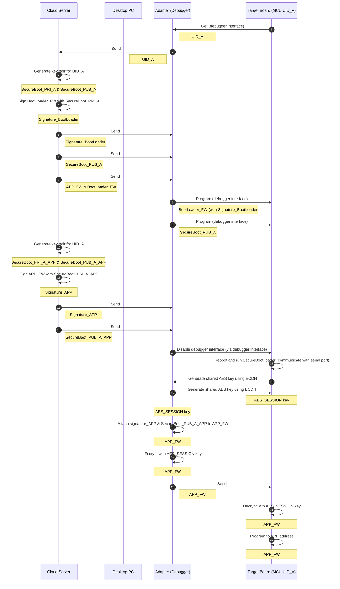

```mermaid
sequenceDiagram
    autonumber
    participant c as Cloud Server
    participant d as Desktop PC
    participant a as Adapter (Debugger)
    participant t as Target Board (MCU UID_A)
    t ->> a : Get (debugger interface)
    Note right of a: UID_A
    a ->> c : Send
    Note left of a: UID_A
    c ->> c : Generate key pair for UID_A
    Note over c : SecureBoot_PRI_A & SecureBoot_PUB_A
    c ->> c : Sign BootLoader_FW with SecureBoot_PRI_A
    Note over c : Signature_BootLoader
    c ->> a : Send
    Note right of c : Signature_BootLoader
    c ->> a : Send
    Note right of c : SecureBoot_PUB_A
    c ->> a : Send
    Note right of c : APP_FW & BootLoader_FW
    a ->> t : Program (debugger interface)
    Note right of a : BootLoader_FW (with Signature_BootLoader)
    a ->> t : Program (debugger interface)
    Note right of a : SecureBoot_PUB_A
    c ->> c : Generate key pair for UID_A
    Note over c : SecureBoot_PRI_A_APP & SecureBoot_PUB_A_APP
    c ->> c : Sign APP_FW with SecureBoot_PRI_A_APP
    Note over c : Signature_APP
    c ->> a : Send
    Note right of c : Signature_APP
    c ->> a : Send
    Note right of c : SecureBoot_PUB_A_APP
    a ->> t : Disable debugger interface (via debugger interface)
    t ->> t : Reboot and run SecureBoot loader (communicate with serial port)
    
    %% ECDH
    t ->> a: Generate shared AES key using ECDH
    a ->> t: Generate shared AES key using ECDH
    Note over t: AES_SESSION key
    Note over a: AES_SESSION key

    a ->> a: Attach signature_APP & SecureBoot_PUB_A_APP to APP_FW
    Note over a: APP_FW
    a ->> a: Encrypt with AES_SESSION key
    Note over a: APP_FW
    a ->> t: Send
    Note right of a: APP_FW
    t ->> t: Decrypt with AES_SESSION key
    Note over t: APP_FW
    t ->> t: Program to APP address
    Note over t: APP_FW
```
