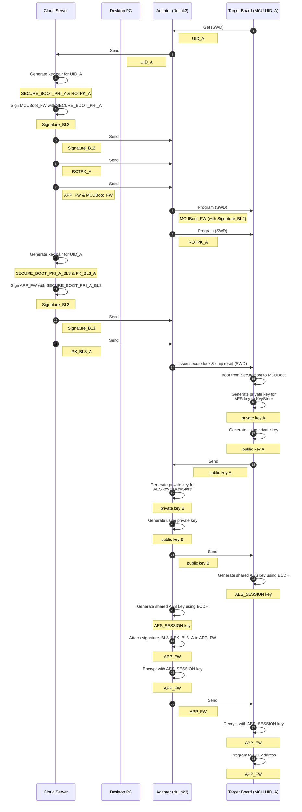

```mermaid
sequenceDiagram
    autonumber
    participant c as Cloud Server
    participant d as Desktop PC
    participant a as Adapter (Nulink3)
    participant t as Target Board (MCU UID_A)
    t ->> a : Get (SWD)
    Note right of a: UID_A
    a ->> c : Send
    Note left of a: UID_A
    c ->> c : Generate key pair for UID_A
    Note over c : SECURE_BOOT_PRI_A & ROTPK_A
    c ->> c : Sign MCUBoot_FW with SECURE_BOOT_PRI_A
    Note over c : Signature_BL2
    c ->> a : Send
    Note right of c : Signature_BL2
    c ->> a : Send
    Note right of c : ROTPK_A
    c ->> a : Send
    Note right of c : APP_FW & MCUBoot_FW
    a ->> t : Program (SWD)
    Note right of a : MCUBoot_FW (with Signature_BL2)
    a ->> t : Program (SWD)
    Note right of a : ROTPK_A
    c ->> c : Generate key pair for UID_A
    Note over c : SECURE_BOOT_PRI_A_BL3 & PK_BL3_A
    c ->> c : Sign APP_FW with SECURE_BOOT_PRI_A_BL3
    Note over c : Signature_BL3
    c ->> a : Send
    Note right of c : Signature_BL3
    c ->> a : Send
    Note right of c : PK_BL3_A
    a ->> t : Issue secure lock & chip reset (SWD)
    t ->> t : Boot from SecureBoot to MCUBoot
    
    %% ECDH
    t ->> t: Generate private key for <br/> AES key to KeyStore
    Note over t: private key A
    t ->> t: Generate using private key
    Note over t: public key A
    t ->> a: Send
    Note left of t: public key A
    a ->> a: Generate private key for <br/> AES key to KeyStore
    Note over a: private key B
    a ->> a: Generate using private key
    Note over a: public key B
    a ->> t: Send
    Note right of a: public key B
    t ->> t: Generate shared AES key using ECDH
    Note over t: AES_SESSION key
    a ->> a: Generate shared AES key using ECDH
    Note over a: AES_SESSION key

    a ->> a: Attach signature_BL3 & PK_BL3_A to APP_FW
    Note over a: APP_FW
    a ->> a: Encrypt with AES_SESSION key
    Note over a: APP_FW
    a ->> t: Send
    Note right of a: APP_FW
    t ->> t: Decrypt with AES_SESSION key
    Note over t: APP_FW
    t ->> t: Program to BL3 address
    Note over t: APP_FW
```