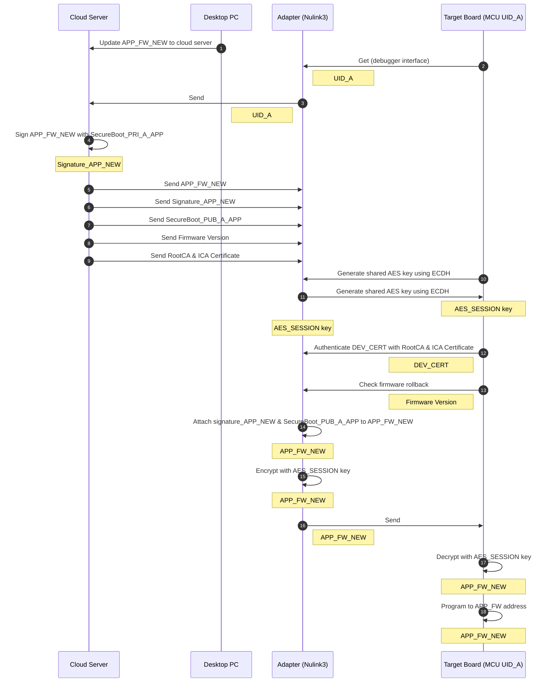

```mermaid
sequenceDiagram
    autonumber
    participant c as Cloud Server
    participant d as Desktop PC
    participant a as Adapter (Nulink3)
    participant t as Target Board (MCU UID_A)

    d ->> c : Update APP_FW_NEW to cloud server
    t ->> a : Get (debugger interface)
    Note right of a: UID_A
    a ->> c : Send
    Note left of a: UID_A

    
    c ->> c : Sign APP_FW_NEW with SecureBoot_PRI_A_APP
    Note over c : Signature_APP_NEW
    c ->> a : Send APP_FW_NEW
    c ->> a : Send Signature_APP_NEW
    c ->> a : Send SecureBoot_PUB_A_APP
    c ->> a : Send Firmware Version
    c ->> a : Send RootCA & ICA Certificate
    
    %% ECDH
    t ->> a: Generate shared AES key using ECDH
    a ->> t: Generate shared AES key using ECDH
    Note over t: AES_SESSION key
    Note over a: AES_SESSION key

    t ->> a: Authenticate DEV_CERT with RootCA & ICA Certificate
    Note left of t: DEV_CERT
    t ->> a: Check firmware rollback
    Note left of t: Firmware Version
    a ->> a: Attach signature_APP_NEW & SecureBoot_PUB_A_APP to APP_FW_NEW
    Note over a: APP_FW_NEW
    a ->> a: Encrypt with AES_SESSION key
    Note over a: APP_FW_NEW
    a ->> t: Send
    Note right of a: APP_FW_NEW
    t ->> t: Decrypt with AES_SESSION key
    Note over t: APP_FW_NEW
    t ->> t: Program to APP_FW address
    Note over t: APP_FW_NEW
```
