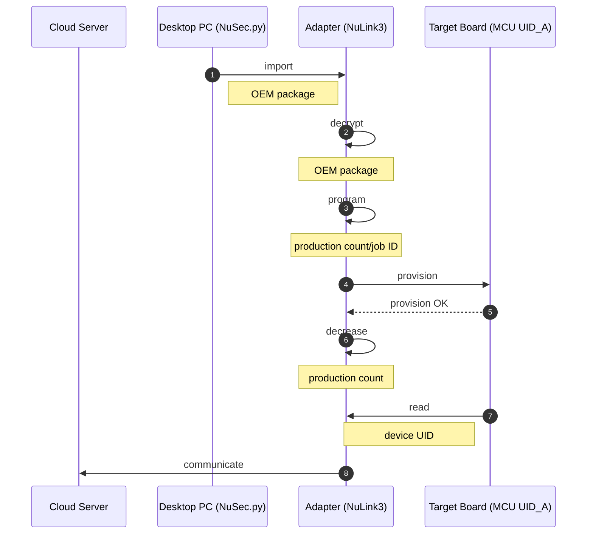

```mermaid
sequenceDiagram
    autonumber
	participant c as Cloud Server
	participant d as Desktop PC (NuSec.py)
	participant a as Adapter (NuLink3)
	participant t as Target Board (MCU UID_A)
    d ->> a: import
    note right of d: OEM package
    a ->> a: decrypt
    note over a: OEM package
    a ->> a: program
    note over a: production count/job ID
    a ->> t: provision
    t-->> a: provision OK
    a ->> a: decrease
    note over a: production count
    t ->> a: read
    note left of t: device UID
    a ->> c: communicate
```
