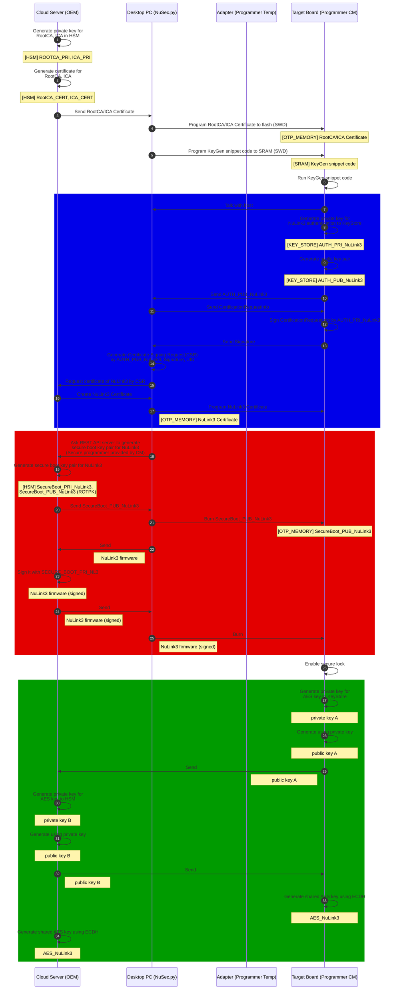

### Prepare NuLink3 programmer for CM (by OEM)

```mermaid
sequenceDiagram
    autonumber
	participant o as Cloud Server (OEM)
	participant n as Desktop PC (NuSec.py)
	participant t as Adapter (Programmer Temp)
	participant p as Target Board (Programmer CM)
    o ->> o: Generate private key for <br/>RootCA, ICA in HSM
    Note over o: [HSM] ROOTCA_PRI, ICA_PRI
    o ->> o: Generate certificate for <br/> RootCA, ICA 
    Note over o: [HSM] RootCA_CERT, ICA_CERT
    o ->> n: Send RootCA/ICA Certificate
    n ->> p: Program RootCA/ICA Certificate to flash (SWD)
    Note over p: [OTP_MEMORY] RootCA/ICA Certificate
    n ->> p: Program KeyGen snippet code to SRAM (SWD)
    Note over p: [SRAM] KeyGen snippet code
    p ->> p: Run KeyGen snippet code

    Rect rgb(0, 0, 233)
    p ->> n: Talk with host
    p ->> p: Generate private key for <br/>NuLink3 authentication to KeyStore
    Note over p: [KEY_STORE] AUTH_PRI_NuLink3
    p ->> p: Generate public key pair
    Note over p: [KEY_STORE] AUTH_PUB_NuLink3
    p ->> n: Send AUTH_PUB_NuLink3
    n ->> p: Send CertificationRequestInfo
    p ->> p: Sign CertificationRequestInfo by AUTH_PRI_NuLink3
    p ->> n: Send Signature
    n ->> n: Generate Certificate Signing Request(CSR) <br/>by AUTH_PUB_NuLink3, Signature, UID
    n ->> o: Request certificate of NuLink3 by CSR
    o ->> n: Create NuLink3 Certificate
    n ->> p: Program NuLink3 Certificate
    Note right of n: [OTP_MEMORY] NuLink3 Certificate
    end

    Rect rgb(227, 0, 0)
    n ->> o: Ask REST API server to generate<br/>secure boot key pair for NuLink3 <br/>(Secure programmer provided by CM) 
    o ->> o: Generate secure boot key pair for NuLink3
    Note over o: [HSM] SecureBoot_PRI_NuLink3, <br/>SecureBoot_PUB_NuLink3 (ROTPK)
    o ->> n: Send SecureBoot_PUB_NuLink3
    n ->> p: Burn SecureBoot_PUB_NuLink3
    Note over p: [OTP_MEMORY] SecureBoot_PUB_NuLink3
    n ->> o: Send
    Note left of n: NuLink3 firmware
    o ->> o: Sign it with SECURE_BOOT_PRI_NL3
    Note over o: NuLink3 firmware (signed)
    o ->> n: Send
    Note right of o: NuLink3 firmware (signed)
    n ->> p: Burn
    Note right of n: NuLink3 firmware (signed)
    end

    p ->> p: Enable secure lock
    
    %%ECDH
    rect rgb(0, 155, 0)
    p ->> p: Generate private key for <br/> AES key to KeyStore
    Note over p: private key A
    p ->> p: Generate using private key
    Note over p: public key A
        p ->> o: Send
    Note left of p: public key A
    o ->> o: Generate private key for <br/> AES key to HSM
    Note over o: private key B
    o ->> o: Generate using private key
    Note over o: public key B
    o ->> p: Send
    Note right of o: public key B
    p ->> p: Generate shared AES key using ECDH
    Note over p: AES_NuLink3
    o ->> o: Generate shared AES key using ECDH
    Note over o: AES_NuLink3
    end

```
